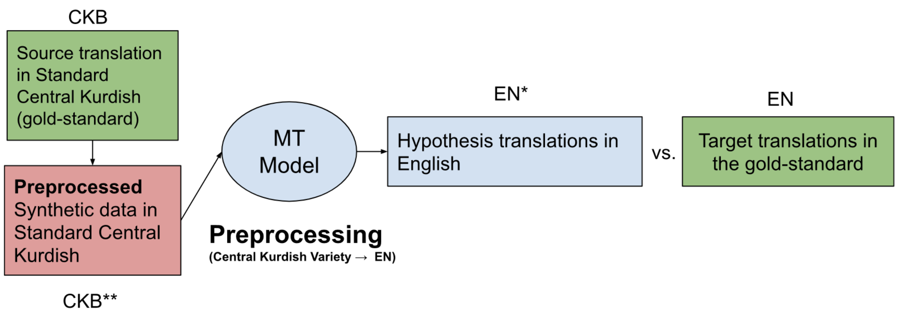
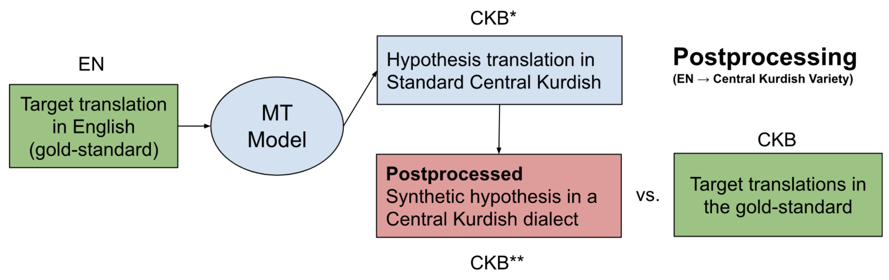

## Machine Translation for Central Kurdish Varieties

In this task, we would like to find out how resilient state-of-the-art models in machine translation (MT) are when it comes to Central Kurdish varieties. To that end, we first create a parallel corpus based on CORDI. The parallel corpus, available in the [gold-standard folder](gold-standard), contains 300 sentences along with Standard Central Kurdish and their translations in English in the following varieties of Central Kurdish:

- Sulaymaniyah (`sl`, Silêmanî)
- Sanandaj (`sn`, Sine)
- Erbil (`hw`, Hewlêr)
- Mahabad (`mh`, Mehabad)

This is a snippet of the parallel corpus:

| English                                                      | Standard                                           | Sulaymaniyah                                           | Erbil                                                 | Mahabad                                               | Sanandaj                                                  |
|--------------------------------------------------------------|----------------------------------------------------|----------------------------------------------------|-------------------------------------------------------|-------------------------------------------------------|------------------------------------------------------|
| I swear, I chased him to the council right there             | وەڵا ڕاوم نا بۆ ئەنجومەنەکەی ئەو بەرە              | وەڵا ڕاوم نا بۆ ئەنجومەنەکەی ئەو بەرە              | وەڵا ڕاوم نا هەتا ئەنجومەنەکەی ئەوبەری                | وەڵا ڕە پێم نا بۆ ئەنجومەنەکەی ئەو بەری               | وەڵا ڕاوم نیا بەرەو ئەنجومەنەکەی ئەو بەرە            |
| That is none of your business                                | ئیلاقەی بە جەنابتەوە نییە                          | ئیلاقەی بە جەنابتەوە نییە                          | عیلاقەی بە جەنابتەوە نییە                             | ڕەبتێکی بە جەنابتەوە نێ                               | ڕەبتی بە جەنابتەو نییە                               |
| What? Did you talk to me?                                    | ها؟ لەگەڵ منتان بوو                                | ها؟ لەگەڵ منتان بوو                                | ها؟ لەگەر منتان بوو                                   | ها؟ دەگەڵ منتان بوو                                   | ها؟ لەتەک منتان بوو                                  |
| They receive and they allow them                             | وەرئەگرن و ئیجازەیان ئەدەینێ                       | وەرئەگرن و ئیجازەیان ئەیەنێ                        | وەردەگرن و ئینجازەیان دەدەنێ                          | وەردەگرن و ئیجازەیان دەدەنێ                           | ئەگرن و ئیجازەیان پێ ئان                             |
| It doesn't have the thingy of Kulera bread.                  | هینی کولێرەی پێوە نییە                             | هینی کولێرەی پێوە نییە                             | هەرامەی کولێرەی پێوە نییە                             | ئی کوللێرەی پێوە نێ                                   | هین کولێرەی پێو نییە                                 |
| Well, we have two types of petrol.                           | وەڵا بەنزین دوو نۆعمان هەیە                        | وەڵا بەنزین دوو نۆعمان هەیە                        | وەڵا بەنزین دوو نەوعمان هەیە                          | وەڵا بەنزین دوو نەوعمان هەیە                          | وەڵا بنزین دوو نەوعمان هەس                           |

## Evaluation
We evaluate [NLLB](https://github.com/facebookresearch/fairseq/tree/nllb) (`nllb-200-distilled-600M` variant) and [Google Translate](https://translate.google.com/) on the parallel corpus. The outputs of these models are available in the [translations folder](translations).

As an additional step, we propose a rule-based system with the following two goals:

- Dialectalization (or *Preprocessing*): Given a text in Standard Central Kurdish, make it look like one of the target varities
- Standardization (or *Postprocessing*): Given a text in a Central Kurdish variety, make it look like Standard Central Kurdish. 

The core idea of these systems is to evaluate how effective synthetic data based on morphological, morphosyntactic and lexical variations would be in MT. 

## Rule-based MT
### Preprocessing
Preprocessing refers to the task where a sentence written in a variety of Central Kurdish is *synthetically* transformed to look like one in Standard Central Kurdish. This process is implemented in [translate\_to\_standard.py](translate_to_standard.py).

  

### Postprocessing
Postprocessing refers to the task where a sentence written in Standard Central Kurdish is *synthetically* transformed to look like one written in a Central Kurdish variety. This process is implemented in [translate\_from\_standard.py](translate_from_standard.py).

  

*In both processes, * refers to a translation hypothesis and ** refers to synthetic data.*

### Additional resources
These two processes rely on the following additional resources:

- A wordlist containing general vocabulary across varieties: [dialect_lexicon.json](dialect_lexicon.json)
- A list of morphosyntactic variations across varieties: [morphosyntactic_variations.json](morphosyntactic_variations.json)
- A list of morphsyntacitic variations across varieties: [morphsyntacitic_lexical.tsv](morphsyntacitic_lexical.tsv)
- A list of terms across varieties: [terms.json](terms.json)

---

**Exercice:** These lists are not exhaustive by any means. Can you extend them automatically, using for example, bilingual lexicon induction? 


