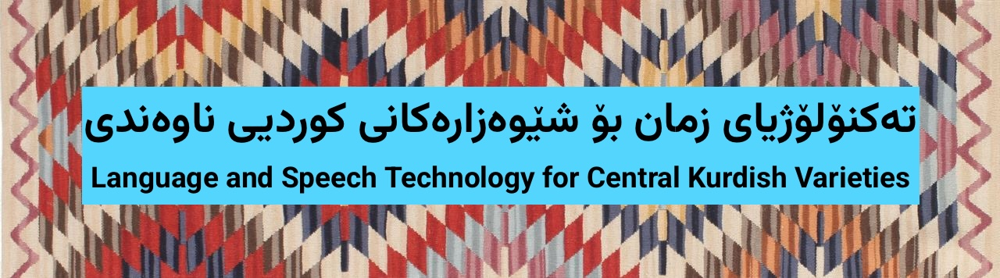
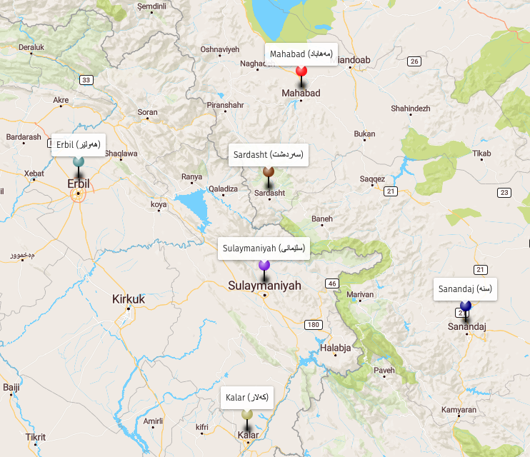

# CORDI -- Corpus of Dialogues in Central Kurdish

<p align="center">
  
</p>


This repository provides resources for language and speech technology for Central Kurdish varieties discussed in our [LREC-COLING 2024 paper](https://sinaahmadi.github.io/docs/articles/ahmadi2024cordi.pdf), particularly the first annotated corpus of spoken Central Kurdish varieties -- CORDI. Given the financial burden of traditional ways of documenting languages and varieties as in fieldwork, we follow a rather novel alternative where movies and series are transcribed. Based on the cities where the content are produced, we categorize the material with the following city names:

- Sulaymaniyah. Traditionally, the variety spoken in this region is referred to as Babani (بابانی)
- Sanandaj. Traditionally, the variety spoken in this region is referred to as Ardalani (ئەردەڵانی).
- Mahabad where the Mukriyani (موکریانی) or Mukri variety is spoken
- Erbil or Hewlêr (هەولێر)
- Sardasht (سەردەشت)
- Kalar (کەلار)


<p align="center">
  
</p>

CORDI contains transcriptions of 311 movies and episodes with 186,038 utterances in more than 100 hours of recording. It is openly available and can pave the way for further progress in NLP tasks for Central Kurdish varieties such as Kurdish ASR and machine translation.

More details can be found in the paper:
[CORDI paper](https://sinaahmadi.github.io/docs/articles/ahmadi2024cordi.pdf)

## Samples

Here are a few samples from CORDI (turn audio on to play):


### Sulaymaniyah:

- Sentence (Female): "ئا دە بەو خوایە هەبێ و نەبێ ئەمە بە دایکی مناڵەکان ئەڵێی شەریکی حەیاتم"

https://github.com/sinaahmadi/CORDI/assets/12765529/d77097e2-9ccc-45e9-85e8-bcda7961a9aa

- Sentence (Male): "نازانی ئەترسن، ئەی نەو بیستوە ئەڵێ ماران گەستە لە گوریسیش ئەترسێ"

https://github.com/sinaahmadi/CORDI/assets/12765529/a67b0ffe-9bd2-411a-ad01-8afca3720686

### Erbil:

- Sentence (Female): "تێگەیشتی بەڵام لەو قازانجەی دەستان دەکەوێ نیوەکی ئی منە"

https://github.com/sinaahmadi/CORDI/assets/12765529/139d14e3-9a5e-474c-a6e4-189e7d204ef6

- Sentence (Male): "پێی برێن ئەگەر ڕای لێ نییە با بڕواتە مەنتیقەکی دیکە تەلەفۆن بکات موشتەریم زۆرە"

https://github.com/sinaahmadi/CORDI/assets/12765529/9ec4b544-fc65-477c-a1fd-ebd6308b7d8d

### Sanandaj:

- Sentence (Female): "دەی مەیه خوەیشکه کی وتییه بییه کەنیشک ئایت بە شوو، بییه بە کەسێ تێر"

https://github.com/sinaahmadi/CORDI/assets/12765529/50491f95-c5b6-4a42-b419-3a51f8722bcf

- Sentence (Male): "بنیام لە بەر ئەو ئاپارتمانە ئەوێسێ، سوح تا ئێوارە تماشای بکا، تێری لێ ناخوا"

https://github.com/sinaahmadi/CORDI/assets/12765529/43a514f2-0984-440a-9988-597df2f3eb49

### Mahabad:

- Sentence (Female): "حا، خەجیج خانم گیان بە قوربانت بم ئەتووش نفووسی خراپ لێ مەدە مە"

https://github.com/sinaahmadi/CORDI/assets/12765529/2f8440b0-ea38-498f-963e-13f5f01dcfb0

- Sentence (Male): "بۆ لەبەر چی ئەرێ ئەمن نازانم ئەو قەدەرەی بۆ هەموو لە من قەلسن بۆ لە من ناڕەحەتن"

https://github.com/sinaahmadi/CORDI/assets/12765529/2051e772-89b2-4b3f-b242-b5ef68c01ed7


## Structure
The metadata of the corpus is described in [JSON](metadata.json) and [TSV](metadata.tsv) with the following information:

```json
{
    "CORDI": {
        "2": {
            "Dialect": "Silêmanî",
            "Title_ckb_arab": "بەرنامەی بەرنامە",
            "Title_ckb_latn": "Bernamey bername",
            "Episode": "1",
            "Episode_ckb_arab": "عەرەبانەکە",
            "Episode_ckb_latn": "`Erebaneke",
            "Type": "Theatre show",
            "Genre": "Comedy",
            "is_synched": true,
            "Comment": "",
            "text": "content/text_original/2.srt",
            "audio": "content/audio/2.wav",
            "video": "content/video/2.mp4"
        }
    }
}
```

Each entry in the metadata file points to a movie or episode which is itself described as follows:

```json
    {
        "filename": "2",
        "utterance_ID": "2",
        "gender": "F",
        "age": "A",
        "text": "وەڵا مەخۆ وەڵا ناوی گرانە ئە ئەمە کەی کوولەکەی خۆمانە",
        "audio": "content/segments/2/2.ogg",
        "dialect": "Silêmanî"
    }
```

## Download CORDI
Only text: 

- [All Transcriptions in JSON](content/CORDI_merged.json) or [TSV](content/CORDI_merged.tsv).
- [Transcriptions](https://drive.google.com/file/d/1giQbsc3t1kE6nI6HNtW7_hi5BEKFgfJp/view?usp=sharing) (5MB): subtitles in `.srt`.
- [Transcriptions in JSON](content/CORDI_text_json.zip) (8MB): the JSON files of the movies and series, individually.

Text + audio:

- [Segments](https://drive.google.com/file/d/1LKSZas4ckFoMDajTjxDIL5BrjLm_6B7J/view?usp=sharing) (4GB) contains utterances in audio (`.ogg`) and their transcriptions in JSON. This can be used for ASR. 

In case you want to work on the original material, you can find the videos here: [link](https://drive.google.com/file/d/1zKw91ogEFbDtQUVjUfzioAt7ZEY3W3JL/view?usp=sharing) (27GB). 

## Downstream tasks

In addition to the corpus, we focus on three downstream tasks in this project: automatic speech recognition (ASR), machine translation (MT) and language identification (LID). While the details of the ASR systems are described in [the paper](https://sinaahmadi.github.io/docs/articles/ahmadi2024cordi.pdf), more details can be found about the two other tasks in their folders: 

- [Machine translation](MT)
- [Language Identification](LID)

## Report problems
Given the size of the projects, it is totally possible that some utterances are not synchronized correctly. We currently don't have much time to each them manually. However, if you notice any serious problem, please consider reporting (in issues) or correct them. We also appreciate any efforts to further clean the transcriptions. 

## Cite this corpus
If you're using this resource, please cite [this paper](https://sinaahmadi.github.io/docs/articles/ahmadi2024cordi.pdf): 

```
@inproceedings{ahmadi2024cordi,
  title = "Language and Speech Technology for {Central Kurdish} Varieties",
  author = "Ahmadi, Sina and Q. Jaff, Daban and Ibn Alam, Md Mahfuz and Anastasopoulos, Antonios",
  booktitle = "Proceedings of the 2024 Joint International Conference on Computational Linguistics, Language Resources and Evaluation (LREC-COLING 2024)",
  month = may,
  year = "2024",
  address = "Torino, Italy",
  publisher = "ELRA Language Resources Association"
}
```

## Acknowledgements
We express our heartfelt gratitude to the volunteers at Koya University who actively participated in the transcription and annotation tasks spanning a period of ten months from June 2021 to April 2022. Many low-resourced languages face financial constraints and Kurdish is regrettably no exception. Nevertheless, the 36 individuals mentioned below (in alphabetical order) showcase how passion for a language can overcome obstacles despite not being remunerated monetarily:

**Niyan** Abdulla Omer, **Sharmin** Ahmadi, **Shnya** Aram Ahmad, **Muhammad** Aram Jalal, **Zaytwn** Awny Sabir, **Lavin** Azwar Omar, **Shnyar** Bakhtyar Karim, **Sazan** Barzani Ali, **Rayan** Bestun Abdulla, **Roshna** Bestun Abdulla, **Halala** Edres Omer, **Elaf** Farhad Muhammad, **Sima** Farhad Qadr, **Ibrahem** Ismail Nadr, **Chnar** Kamal Sleman, **Muhamad** Kamaran Ahmad, **Raman** Kazm Hamad, **Burhan** Luqman Khursheed, **Shaima** Mikaeel Esmaeel, **Lavan** Muhammad Smail, **Dween** Muhammed Jamal, **Hana** Muhammed Rashid, **Amen** Muhseen Nasr, **Bryar** Murshid Mustafa, **Rayan** Mzafar Tofiq, **Taban** Omar Mohamad, **Nian** Qasim Jaff, **Dilan** Raza Nadr, **Razaw** S. Bor, **Soma** Salam Arif, **Zulaykha** Samad Abdulla, **Awdang** Saman Abdullqahar, **Eman** Sardar Hamed, **Sakar** Star Omar, **Nawa** Taha Yasin, **Triska** Zrar Mawlood. 

**Muhammad** Aziz, **Harman** Hameed and  **Xaliss** Jamal kindly contributed to the translation of sentences of the Erbil variant in the parallel corpus as well.

## License

This work is licensed under a
[Creative Commons Attribution-ShareAlike 4.0 International License][cc-by-sa].

[![CC BY-SA 4.0][cc-by-sa-image]][cc-by-sa]

[cc-by-sa]: http://creativecommons.org/licenses/by-sa/4.0/
[cc-by-sa-image]: https://licensebuttons.net/l/by-sa/4.0/88x31.png
